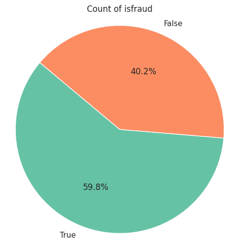

<!DOCTYPE html>
<html lang="en">
<head>
    <meta charset="UTF-8">
    <meta name="viewport" content="width=device-width, initial-scale=1.0">
</head>

<body>
    <h1>Bank Transaction Fraud</h1>
    <h2>Data Structure and Content</h2>
    
The dataset comprises 2340 rows and 7 columns. Here's a breakdown of the dataset:

    <h3>Columns:</h3>
    <ul>
        <li><strong>typeofaction</strong>: Action type, either "transfer" or "cash-in".</li>
        <li><strong>sourceid</strong>: Source account ID.</li>
        <li><strong>destinationid</strong>: Destination account ID.</li>
        <li><strong>amountofmoney</strong>: Amount of money involved in the transaction.</li>
        <li><strong>date</strong>: Date and time of the transaction.</li>
        <li><strong>isfraud</strong>: Indicates if the transaction is fraudulent (1 for yes, 0 for no).</li>
        <li><strong>typeoffraud</strong>: Type of fraud if applicable ('type1', 'type2', 'type3').</li>
    </ul>
    <h3>Data Types:</h3>
    <ul>
        <li>typeofaction: object</li>
        <li>sourceid: int64</li>
        <li>destinationid: int64</li>
        <li>amountofmoney: int64</li>
        <li>date: datetime</li>
        <li>isfraud: boolean</li>
        <li>typeoffraud: object</li>
    </ul>
    
We've made some data type conversions for efficiency:

    <ul>
        <li>Converted 'isfraud' to boolean.</li>
        <li>Transformed 'date' to datetime.</li>
        <li>Converted 'sourceid' and 'destinationid' to categorical types.</li>
    </ul>
    <h2>Data Cleaning</h2>
    <h3>Duplicate Rows:</h3>
    
No duplicate rows were found.

    <h3>Missing Values:</h3>
    
The dataset has no missing values.

    <h3>Outliers:</h3>
    
No outliers were detected.

    <h2>Exploratory Data Analysis (EDA)</h2>
    
After ensuring that the data is clean, we now proceed with exploration and analysis

    <h3>Distribution of Amount of Money</h3>
    
    <h4>Insights:</h4>
    <ul>
        <li>The majority of transactions involve amounts of money ranging from 0 to 10000, with a peak at around 800.</li>
        <li>As the amount increases beyond 10000, the frequency of transactions sharply decreases.</li>
        <li>The distribution is right-skewed, indicating that most transactions involve smaller amounts, with only a few involving larger sums.</li>
    </ul>
    <h3>Fraudulent Transactions</h3>
    
    
    <h4>Insights:</h4>
    <ul>
        <li>A significant number of transactions in the dataset are fraudulent, with a difference of 485 compared to non-fraudulent transactions.</li>
    </ul>
    <h3>Types of Fraud</h3>
    
    
    <h4>Insights:</h4>
    <ul>
        <li>Among the fraudulent transactions, the most common type of fraud is 'type3', followed by 'type2', and then 'type1'.</li>
        <li>'type3' appears to be the predominant type of fraud in the dataset.</li>
    </ul>
    <h3>Amount of Money Over Time</h3>
    
    <h4>Insights:</h4>
    <ul>
        <li>The amount of money involved in transactions fluctuates over time, ranging between 10000 and 8000000.</li>
        <li>There is no clear trend or pattern observed in the fluctuation of transaction amounts over the specified date range.</li>
    </ul>
    <h3>Amount of Money vs. Fraud Status</h3>
    
    <h4>Insights:</h4>
    <ul>
        <li>Transactions without fraud tend to involve relatively stable amounts of money.</li>
        <li>In contrast, most fraudulent transactions occur within two main ranges: between 0 and 1000000, and between 5000000 and 8000000.</li>
        <li>This suggests that fraudulent activities are more likely to involve either smaller or larger amounts, with fewer fraudulent transactions occurring in between these ranges.</li>
    </ul>
    <h3>Types of Actions by Fraud Status</h3>
    
    <h4>Insights:</h4>
    <ul>
        <li>The 'transfer' action is more common than the 'cash-in' action in the dataset.</li>
        <li>Both types of actions have a higher number of fraudulent transactions compared to non-fraudulent ones.</li>
        <li>Fraudulent transactions outnumber non-fraudulent ones across both action types, indicating that fraudulent activities are prevalent regardless of the type of action involved.</li>
    </ul>
  
</body>

</html>
