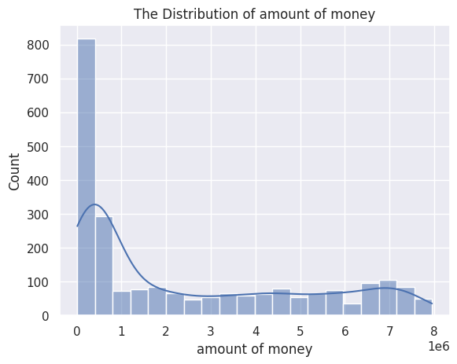

<!DOCTYPE html>
<html lang="en">
<head>
    <meta charset="UTF-8">
    <meta name="viewport" content="width=device-width, initial-scale=1.0">
</head>

<body>
    <h1>Assignment on EDA</h1>
    <h2>Data Structure and Content</h2>
    
The dataset comprises 2340 rows and 7 columns. Here's a breakdown of the dataset:

    <h3>Columns:</h3>
    <ul>
        <li><strong>typeofaction</strong>: Action type, either "transfer" or "cash-in".</li>
        <li><strong>sourceid</strong>: Source account ID.</li>
        <li><strong>destinationid</strong>: Destination account ID.</li>
        <li><strong>amountofmoney</strong>: Amount of money involved in the transaction.</li>
        <li><strong>date</strong>: Date and time of the transaction.</li>
        <li><strong>isfraud</strong>: Indicates if the transaction is fraudulent (1 for yes, 0 for no).</li>
        <li><strong>typeoffraud</strong>: Type of fraud if applicable ('type1', 'type2', 'type3').</li>
    </ul>
    <h3>Data Types:</h3>
    <ul>
        <li>typeofaction: object</li>
        <li>sourceid: int64</li>
        <li>destinationid: int64</li>
        <li>amountofmoney: int64</li>
        <li>date: datetime</li>
        <li>isfraud: boolean</li>
        <li>typeoffraud: object</li>
    </ul>
    
We've made some data type conversions for efficiency:

    <ul>
        <li>Converted 'isfraud' to boolean.</li>
        <li>Transformed 'date' to datetime.</li>
        <li>Converted 'sourceid' and 'destinationid' to categorical types.</li>
    </ul>
    <h2>Data Cleaning</h2>
    <h3>Duplicate Rows:</h3>
    
No duplicate rows were found.

    <h3>Missing Values:</h3>
    
The dataset has no missing values.

    <h3>Outliers:</h3>
    
No outliers were detected.

    <h2>Exploratory Data Analysis (EDA)</h2>
    <h3>Distribution of Amount of Money</h3>
    
The distribution of the amount of money is right-skewed, with most values ranging between 0 and 100 after a peak
        at around 800.

    
    <h3>Fraudulent Transactions</h3>
    
Most transactions in the dataset are fraudulent.

    
    <h3>Types of Fraud</h3>
    
The most common type of fraud is 'type3', followed by 'type2', and then 'type1'.

    
    <h3>Amount of Money Over Time</h3>
    
The values fluctuate between 10,000 and 8,000,000 over time.

    
    <h3>Amount of Money vs. Fraud Status</h3>
    
Most fraudulent transactions occur between 0 and 1,000,000, as well as between 5,000,000 and 8,000,000.

    
    <h3>Types of Actions by Fraud Status</h3>
    
The 'transfer' action is more frequent than 'cash-in', and fraudulent transactions outnumber non-fraudulent ones
        in both actions.

    
  
</body>

</html>
